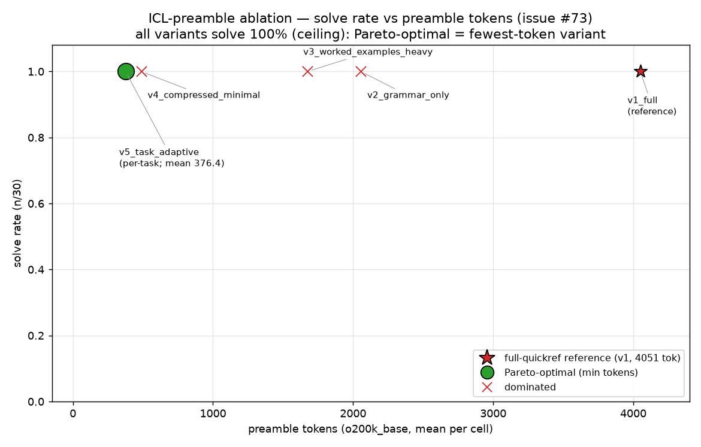

# ICL-preamble ablation — cold-solver report (issue #73)

## TL;DR / winner

**`v4_compressed_minimal` matches the full-quickref solve rate within 0 pts at 12.0% of the tokens.**
**`v5_task_adaptive` matches it within 0 pts at 9.3% of the tokens.**

All five preamble variants solved **100%** of the battery (30/30 cells each). The
in-context language reference handed to a cold MTL solver can be compressed from
the **4,051-token** full quickref (`docs/mtl-quickref.md`) down to a **487-token**
one-line-per-primitive table with **no loss** of solve rate on these ten pure
tasks.

- **Recommended new default COLD preamble: `v4_compressed_minimal`** — a fixed,
  drop-in 487-token file (12.0% of 4,051), 100% solve, no per-task inspection
  required.
- **Theoretical frontier point: `v5_task_adaptive`** — per-task primitive
  selection, mean 376.4 tokens (9.3% of 4,051), also 100% solve. Lowest tokens on
  the Pareto frontier, but needs to know each task's primitives up front (see
  caveats), so it is not a drop-in.

Because solve-rate saturates at 1.0 for every variant, the discriminating signal
is in the **secondary metrics**: first-attempt success rate and attempts-to-first-
correct. There `v4` is as clean as the full quickref (0.967 first-attempt,
1.033 mean attempts — identical to `v1_full`), while `v5`'s aggressive per-task
pruning costs some first-attempt robustness (0.767 first-attempt, 1.267 mean
attempts). This is the practical reason to prefer `v4` as the default and treat
`v5` as the theoretical floor.

## Pareto table

Objective: maximize solve-rate, minimize preamble tokens. With solve-rate at the
ceiling for all variants, the non-dominated set collapses to the single
**minimum-token** variant (`v5_task_adaptive`); `v4_compressed_minimal` is the
best **fixed** (non-adaptive) point.

| Variant | Preamble o200k tok | % of full | Solve-rate (n/30) | First-attempt success | Median tokens-to-first-correct | Pareto-optimal? |
|---|---:|---:|---:|---:|---:|:--:|
| `v1_full` (reference) | 4051 | 100.0% | 1.000 (30/30) | 0.967 | 4055.5 | no |
| `v2_grammar_only` | 2055 | 50.7% | 1.000 (30/30) | 1.000 | 2059.5 | no |
| `v3_worked_examples_heavy` | 1675 | 41.3% | 1.000 (30/30) | 0.933 | 1682.0 | no |
| `v4_compressed_minimal` | 487 | 12.0% | 1.000 (30/30) | 0.967 | 492.5 | no (best fixed) |
| `v5_task_adaptive` | 376.4 (mean) | 9.3% | 1.000 (30/30) | 0.767 | 382.0 | **yes** |



Mean attempts-to-first-correct: `v1_full` 1.033, `v2_grammar_only` 1.000,
`v3_worked_examples_heavy` 1.067, `v4_compressed_minimal` 1.033,
`v5_task_adaptive` 1.267.

Median tokens-to-first-correct is dominated by the preamble term because the
programs themselves are tiny (~4-15 o200k tokens) and nearly every cell passed on
attempt 1; it tracks preamble size almost exactly (e.g. `v4` = 487 preamble +
~5.5 program).

Raw per-cell ledger (all 150 cells, one JSON object per line, sorted by
variant/task/trial, including the emitted programs): [`results/results.jsonl`](results/results.jsonl).
Machine-readable metrics: [`results/metrics.json`](results/metrics.json);
frontier: [`results/pareto.json`](results/pareto.json).

## The #80 break-even tie-in (why this matters)

Issue #80 found the MTL-vs-Python session-economics crossover **structurally
unreachable**: the 4,051-token quickref, even fully cached at 0.10x input, levies
a per-task cache-read tax that alone exceeds Python's entire cost-per-correct, and
MTL's measured per-task output savings (**6.96 tokens/task**) are an order of
magnitude too small to amortize it. The dominant term in that verdict is `Q`, the
preamble size — which is exactly what this ablation shrinks.

Break-even model (verbatim from #80), recomputed by substituting the winner's
smaller `Q` (the cache-read tax term scales **linearly** in `Q`; the input-penalty
term is `Q`-independent). Pricing factors `pr = cache_read_mult` and
`p_in/p_out = 1/(p_out/p_in)` and the input penalty `(P_mtl - P_py) = 8.389` are
read from `bench/agent-trial/sessions/results/summary.json`, not hardcoded:

```
dO_taxonly = Q * pr * (p_in/p_out)
dO_full    = dO_taxonly + (P_mtl - P_py) * (p_in/p_out)
```

Measured output savings delivered by MTL on this battery = **6.963 tokens/task**
(the bar dO must clear). Recomputed under the three #80 pricing configs:

| Config | Q | dO_taxonly | dO_full | Gap (dO_full / 6.96) | Crossover reached? |
|---|---:|---:|---:|---:|:--:|
| **default** (Opus rates, p_out=5x p_in, cache_read=0.10x) | 4051 (full) | 81.02 | 82.70 | **11.88x** | no |
| | 487 (v4) | 9.74 | 11.42 | **1.64x** | no |
| | 376.4 (v5) | 7.53 | 9.21 | **1.32x** | no |
| **alt2** (cheaper output, p_out=4x p_in) | 4051 (full) | 101.28 | 103.37 | 14.85x | no |
| | 487 (v4) | 12.18 | 14.27 | 2.05x | no |
| | 376.4 (v5) | 9.41 | 11.51 | 1.65x | no |
| **alt3** (dearer cache read, cache_read=0.25x) | 4051 (full) | 202.55 | 204.23 | 29.33x | no |
| | 487 (v4) | 24.35 | 26.03 | 3.74x | no |
| | 376.4 (v5) | 18.82 | 20.50 | 2.94x | no |

(The recomputed full-`Q` values reproduce #80's `summary.json` exactly — 82.70 /
103.37 / 204.23 — confirming the substitution is faithful.)

**Gap-ratio collapse (default config):** the required-dO gap over what this battery
already delivers falls from **~11.9x** at the full 4,051-token preamble to
**~1.3-1.6x** at the winner sizes (1.64x for v4, 1.32x for v5). On the tax-only
term the collapse is even sharper — v5's tax-only requirement is 7.53 tok/task,
just **1.08x** the measured 6.96.

**Is crossover actually reached for this battery? No — but the gap is now small
and honest.** Measured savings 6.96 tok/task still fall short of the required
dO_full at every winner size (default: 9.21 for v5, 11.42 for v4), and short even
of v5's tax-only requirement of 7.53. So shrinking the preamble does **not** by
itself flip #80's verdict on this saturated pure-task battery. What it does do is
turn a **structurally unreachable** ~12x shortfall into a **~1.1-1.6x near-miss**:
the 4,051-token preamble was the dominant obstruction, and cutting `Q` roughly
8-10x cuts the per-task cache-read tax proportionally, bringing the required output
savings to within ~10-30% of what MTL already delivers here. A modestly larger
output-token edge (from harder tasks where MTL's density pays off, or a slightly
tighter preamble) would plausibly close the remainder — a claim #80 could not make
at all. Machine-readable: [`results/breakeven_recompute.json`](results/breakeven_recompute.json).

## Honest caveats

1. **Ceiling effect — solve-rate cannot discriminate.** 100% solve on all five
   variants means the headline metric is saturated; the *finding* is narrower than
   "prose is useless." It is: **these ten pure tasks need only the glyph/primitive
   table, not the surrounding prose.** That does **not** license dropping prose for
   harder tiers. Capability-heavy or Tier-3 tasks (roadmap #17; the read-tax
   ceiling caveat) may genuinely need the worked examples and host-capability
   sections that `v3`/`v4`/`v5` strip. The discriminating signal here lives only in
   the secondary metrics (first-attempt success, attempts-to-first-correct).
2. **`v5`'s operational chicken-and-egg.** The task-adaptive preamble includes only
   the primitives a task's reference solution uses — but selecting it requires
   already knowing which primitives the task needs, which is part of what you are
   asking the solver to discover. `v5` is the theoretical token floor, not a
   deployable default. Its lower first-attempt success (0.767 vs `v4`'s 0.967) is a
   direct symptom: prune too hard and the solver occasionally needs a repair round
   to recover a primitive that was omitted.
3. **Capability / Tier-3 out of scope by construction.** Three of the five variants
   (`v3`, `v4`, `v5`) drop the host-capability section entirely; the battery is ten
   pure tasks. The task-adaptive path is capability-aware in principle but is
   **untested** on capability tasks here. Do not extrapolate the 487-token winner to
   capability workloads without a fresh ablation.
4. **Tokens-to-first-correct is preamble-dominated.** Programs are ~4-15 o200k
   tokens and nearly all cells passed on attempt 1, so median tokens-to-first-
   correct is essentially the preamble size plus a handful of program tokens. It is
   a proxy for preamble size on this battery, not an independent quality signal.

## Method

- **Protocol:** one **cold, context-isolated fresh subagent per cell** (150 cells =
  5 variants x 10 pure tasks x 3 trials). Each solver reads **only its variant
  file** as the language reference — `v1`-`v4` a single `variants/<variant>.md`,
  `v5` the single `variants/v5_task_adaptive/<task>.md` — plus the task's MTL
  prompt and I/O vectors. It may not read `docs/mtl-quickref.md`, the reference
  solutions, or any other variant. The solver returns only an MTL program.
- **Validation:** deterministic `mtlrun` via `bench/agent-trial/validate_one.py`
  (never an LLM judge). Verdict = the emitted JSON's `ok` field.
- **Repair loop:** on `ok=false` the validator's real diagnostic (`error_type` +
  `error_detail`, the actual `FAULT:`/`stack:`/`next:` text or got-vs-expected
  diff, plus the failing vector) is fed back verbatim. Up to **N = 5** attempts
  (attempt 1 = first try, 2-5 = repairs); stop on first `ok=true`.
- **Trials:** 3 per `(variant, task)`, matching the base agent-trial.
- **Pinned model:** `claude-opus-4-8`.
- **Token method:** o200k_base via `bench/tokcount` (tiktoken), one trailing
  newline stripped per file — identical normalization to `validate_one.py`.
  Preamble sizes are frozen in `variant_tokens.json`; for `v5`, each cell records
  its own per-task preamble token count (not the mean).

### Artifacts

| File | Contents |
|---|---|
| [`results/results.jsonl`](results/results.jsonl) | raw per-cell ledger (150 lines, incl. emitted programs) |
| [`results/metrics.json`](results/metrics.json) | per-variant solve-rate, median tokens-to-first-correct, mean attempts, first-attempt success |
| [`results/pareto.json`](results/pareto.json) / [`results/pareto.png`](results/pareto.png) | Pareto frontier + plot |
| [`results/breakeven_recompute.json`](results/breakeven_recompute.json) | #80 break-even dO recomputed at Q=4051/487/376.4 across configs |
| [`winner_manifest.json`](winner_manifest.json) | #45 handoff: winner ids, preamble paths, Q, solve-rate, recomputed dO |
