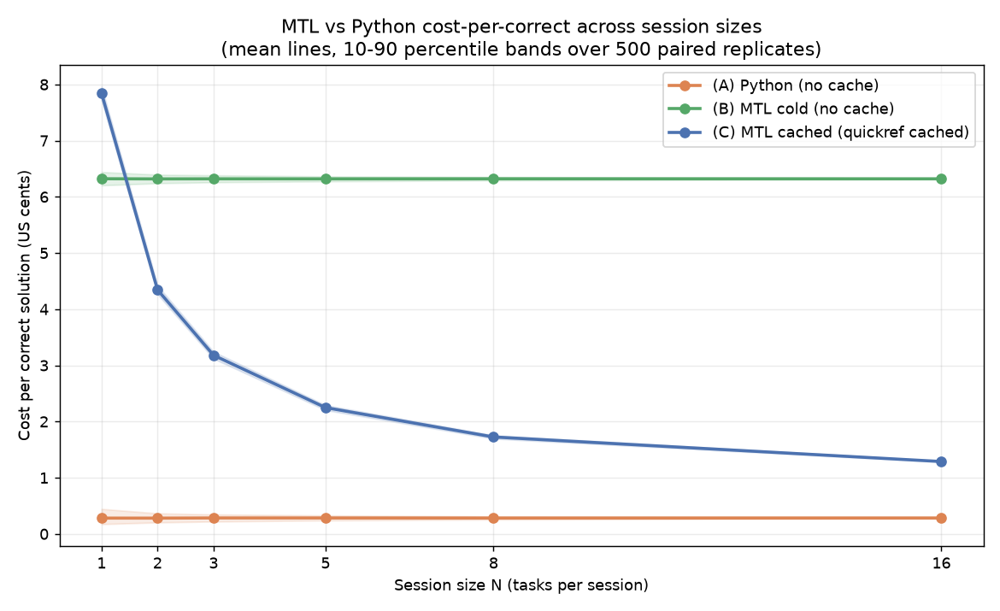

# Session-economics crossover harness — issue #45

## Headline

- **Measured N\* (MTL-cached arm) = none within N ∈ {1, 2, 3, 5, 8, 16}.** There is
  no session size at which the MTL-cached cost-per-correct-solution drops below the
  Python cost-per-correct-solution.
- **Uncached crossover (MTL-cold arm) = none within range** either — as anticipated.
- **Target N\* ≤ 3 was NOT met.** Reported honestly and unengineered, per the spec.
  The crossover does not merely fall outside the tested grid; it is *structurally
  unreachable* at these task sizes (see the break-even analysis below).
- **Plain-language takeaway:** At the tiny program sizes in this battery, the MTL
  quick-reference prefix (Q = **4,051** o200k tokens) is so large relative to the
  per-task programs that even when it is fully cached (billed at 0.10× input) its
  per-task cache-read tax (**0.61 US cents/task**) alone exceeds Python's *entire*
  cost-per-correct (**~0.28 cents**). MTL's per-task output-token savings (~7
  tokens) are an order of magnitude too small to amortize the quickref. **Under
  this model, prefer Python for these tasks regardless of session length; MTL's
  quickref tax never pays for itself.**

The measured curve (mean lines + 10–90 percentile bands, 500 paired replicates per
N, default price config):



Because there is no crossover, `curve.png` carries no N\* vertical marker; the three
arms never intersect in the tested range.

## Cost-per-correct per N per arm (default config)

Cost-per-correct is in **US cents**. `frac C<A` / `frac B<A` are the fraction of the
500 replicates in which the MTL-cached / MTL-cold cost-per-correct beat Python
(robustness check). `mtl succ` / `py succ` are the mean per-task success rates over
the sampled sessions.

| N  | (A) Python | (B) MTL cold | (C) MTL cached | frac C<A | frac B<A | mtl succ | py succ |
|----|-----------:|-------------:|---------------:|---------:|---------:|---------:|--------:|
| 1  |    0.2816  |     6.3217   |     7.8409     |  0.000   |  0.000   |  1.000   |  1.000  |
| 2  |    0.2812  |     6.3188   |     4.3439     |  0.000   |  0.000   |  1.000   |  1.000  |
| 3  |    0.2840  |     6.3201   |     3.1806     |  0.000   |  0.000   |  1.000   |  1.000  |
| 5  |    0.2841  |     6.3197   |     2.2485     |  0.000   |  0.000   |  1.000   |  1.000  |
| 8  |    0.2829  |     6.3210   |     1.7257     |  0.000   |  0.000   |  1.000   |  1.000  |
| 16 |    0.2836  |     6.3204   |     1.2883     |  0.000   |  0.000   |  1.000   |  1.000  |

The cached arm (C) does exactly what caching is supposed to do — it falls
monotonically as N grows (the one-time cache-write amortizes and the per-task cost
approaches its floor). But its floor is well above Python. The cold arm (B) is
essentially flat: it re-reads the full 4,051-token quickref as fresh input on
*every* task, so its per-task cost never amortizes.

## The cached-arm overlay (how caching is priced)

For an ordered session of N tasks, the MTL-cached arm (C) is billed:

- **task 1:** the quickref is written to cache once → `Q · pw` where `pw = 1.25 · p_in`
  (5-minute cache-write multiplier).
- **tasks 2..N:** the quickref is served from cache → `Q · pr · (N − 1)` where
  `pr = 0.10 · p_in` (cache-read multiplier).
- **every task:** its own marginal input+output → `Σ_i [ P_mtl(t_i) · p_in + O_mtl(t_i) · p_out ]`.

At the default prices (`p_in = $15/M`), the per-task cache-read tax is
`Q · pr = 4051 · 0.10 · $15/M = $0.006077 = 0.6077 cents/task`. That single term
already more than doubles Python's whole per-correct cost.

For comparison:
- **(A) Python (no cache):** `Σ_i [ P_py(t_i) · p_in + O_py(t_i) · p_out ]` — no
  quickref, because Python is a warm language for the model and was given no
  language reference in the trial.
- **(B) MTL cold (no cache):** `Σ_i [ (Q + P_mtl(t_i)) · p_in + O_mtl(t_i) · p_out ]`
  — the status quo, quickref re-read as full input on every task.

### Why the crossover is structurally unreachable

Asymptotically (N large, cache-write amortized to zero), MTL-cached beats Python
per task iff:

```
Q · pr · p_in  +  P_mtl · p_in  +  O_mtl · p_out   <   P_py · p_in  +  O_py · p_out
```

Rearranging, MTL must recover the cache-read tax `Q · pr · p_in` (plus its input
penalty) purely through output-token savings. The **output savings needed just to
cover the cache-read tax** is `Q · pr · p_in / p_out = 81.0 tokens/task`. The
measured reality across the 18-task battery:

| Quantity (mean over 18 tasks) | Value |
|---|---:|
| Output savings MTL delivers, `O_py − O_mtl` | **6.96 tokens/task** |
| Input *penalty* MTL pays, `P_mtl − P_py` | **8.39 tokens/task** (MTL prompts are *larger*) |
| Output savings *required* to offset the cache-read tax alone | **81.0 tokens/task** |

MTL saves ~7 output tokens/task but needs to save ~81 just to break even on the
cached quickref — and it simultaneously pays ~8 *extra* input tokens/task on its
arm-specific prompt. The gap is more than 10×, so no N in range (or beyond) closes
it. This is why every replicate has `frac C<A = 0.000`.

### Break-even task size — the concrete adoption condition (per config)

`break_even_analysis()` (emitted deterministically to `summary.json` → `break_even`)
solves the asymptotic margin inequality for the per-task **output-token savings ΔO**
that *would* produce a crossover, at each price config. `ΔO(tax)` covers only the
cache-read tax (`cr_mult·Q·p_in/p_out`); `ΔO(full)` additionally covers MTL's ~8.4-token
input penalty. `shortfall` is `ΔO(full)` ÷ the **measured** 6.96 tokens/task.

| Config | ΔO needed (tax only) | ΔO needed (full) | shortfall vs measured 6.96 |
|---|---:|---:|---:|
| `default` / `opus48_published` / `alt1_1h_cache` (5:1 out:in, 0.10× read) | 81.0 | 82.7 | **11.9×** |
| `alt2_lower_out_ratio` (4:1 out:in) | 101.3 | 103.4 | 14.9× |
| `alt3_dearer_cache_read` (0.25× read) | 202.6 | 204.2 | 29.3× |

**Stated plainly:** a crossover requires a workload whose MTL solutions compress the
*output* by **≈81 tokens/task** (≈12× the ~7 tokens this battery delivers) — i.e. tasks
whose Python solutions run many tens-to-hundreds of tokens longer than their MTL
equivalents. This 18-task battery of single-digit-to-tens-of-token programs (mean
`O_py` ≈ 20 tokens/task) is *far* below that threshold: to break even the Python
solution would have to be roughly **4–5× larger** in emitted output than it is here,
holding the MTL side fixed. Under every priced config the measured savings fall short
by 12×–29×, so the negative result is not a knife-edge — it is a wide, structural gap.

## Sensitivity (N\* under alternate price configs)

`pricing.json` carries the default plus four alternate configs; the harness sweeps
all of them. N\* is unchanged (none) in every case — the cache-read tax vs
output-savings gap is too large for any of these levers to bridge:

| Config | Description | N\* cached | N\* cold |
|---|---|:---:|:---:|
| `default` | Opus-tier $15/$75, cache 1.25× / 0.10× (spec-mandated) | none | none |
| `opus48_published` | Current published Opus 4.8 $5/$25 (same ratios) | none | none |
| `alt1_1h_cache` | 1-hour cache write (2.0× instead of 1.25×) | none | none |
| `alt2_lower_out_ratio` | Cheaper output ratio (p_out = 4× p_in) | none | none |
| `alt3_dearer_cache_read` | Dearer cache read (0.25× instead of 0.10×) | none | none |

**Scale-invariance check.** `opus48_published` is the default uniformly rescaled by
1/3 (same 5:1 output:input ratio, same cache multipliers) and reproduces the default
N\* **exactly**. This confirms the analytic point: **N\* depends only on the
p_out:p_in ratio and the cache multipliers, not on the absolute price scale.** So the
$15/$75-vs-$5/$25 discrepancy between the spec-mandated default and the current
published Opus 4.8 sticker (see *Pricing provenance*) does not affect N\* at all.

**Which lever moves N\* most?** None of them move it into range here, but their
*directional* effect on the required break-even is:
- **Output:input ratio dominates.** N\* is governed by how many output tokens MTL
  must save to offset the quickref. `alt2` (p_out = 4× p_in) *lowers* the value of
  each saved output token, so it makes the crossover *harder* (raises the required
  break-even from 81 to ~101 tokens/task). Raising the output ratio would be the
  single most effective lever toward a crossover.
- **Cache-read multiplier is second.** `alt3` (0.25× cache read) raises the per-task
  tax from 0.61 → 1.52 cents, pushing N\* further out. Halving it would help but not
  enough — even a free cache read (0.0×) would still leave MTL paying its ~8-token
  input penalty against only ~7 tokens of output savings, so the cached arm would
  land at roughly break-even, not clearly below Python.
- **1-hour cache write (`alt1`)** only changes the one-time task-1 term; it shifts the
  small-N head of the cached curve up slightly and is irrelevant asymptotically.

## Success-parity check

Every task in the 18-task battery was solved within the 5-attempt repair budget in
**both** arms across **all** trials (tier-2: 3 trials/arm, `p_correct_within_5 = 1.0`
for both arms; tier-3: 2 trials/arm, all cells `solved = true`). Consequently the
mean per-task success rate is **1.000 for MTL and 1.000 for Python at every N** —
MTL success is equal-or-better at every N, and **no N is flagged** for an MTL success
deficit. This is recorded machine-checkably as the `mtl_success_deficit_flag` column
in `curve.csv` and `summary.json` (`= mtl_success_mean < py_success_mean`), which is
`False` at every N. Cost-per-correct therefore equals cost-per-task here; the `/num_correct`
normalization is a no-op on this battery but is implemented generally (it divides by
the summed per-task solved-fractions, so it would down-weight any arm that failed).

## Token model and modeling assumptions

Implemented exactly as specified in issue #45 §3. Four token buckets are tracked and
priced **separately** per arm — `normal_input`, `output`, `cache_write`,
`cache_read` — and recorded per replicate in `results/ledger.jsonl`.

Assumptions, stated plainly:

1. **Marginal-cost simplification.** We model each task's *marginal* cost
   (arm-specific prompt + emitted solution) plus the MTL quickref prefix. We do **not**
   model the quadratic growth of accumulated conversation history within a session.
   That history term is common to all three arms (symmetric) and, because success is
   1.0 for both arms here (so the per-correct denominator is identical across arms in
   any given sample), adding it would raise all arms' numerators by the same amount
   and leave the crossover unchanged. Omitting it therefore does not bias N\* — the
   quickref is the sole arm-differentiating fixed cost, which is exactly what #45
   measures.
2. **Cache lifecycle.** Task 1 pays the cache-write (1.25× input at the default);
   tasks 2..N pay the cache-read (0.10× input). The quickref is treated as a single
   stable cacheable prefix that stays warm for the whole session.
3. **Per-task success as an expected count.** `num_correct` for a session is the sum
   of per-task solved-fractions (an expected-corrects count). On this battery every
   fraction is 1.0, so num_correct = N exactly.
4. **Output tokens are measured cold-run outputs**, summed over all attempts up to and
   including the first correct one (all-attempts-to-first-correct cost). Hidden
   reasoning tokens are excluded from both arms — as in the source trials — so the
   comparison stays apples-to-apples.

## Provenance of every input

| Input | Source | Notes |
|---|---|---|
| **Q** (quickref prefix) | `tokcount(docs/mtl-quickref.md)` o200k = **4051** | Measured at run time, not hardcoded. Matches the spec's expected ~4051. |
| **Tier-2 P_py / P_mtl** (10 tasks) | o200k tokcount of `bench/agent-trial/payload.json` `python_prompt` / `mtl_prompt` | payload.json is the authoritative solver-prompt file; the quickref is a separate prefix, not embedded in these per-task prompts. |
| **Tier-2 O / success** | `bench/agent-trial/results/results.jsonl` — `program_tokens_o200k` summed over attempts 1..first-correct, meaned over 3 trials; `ok` flags for success | All 10 tasks × both arms solved (`metrics.json` `p_correct_within_5 = 1.0`). |
| **Tier-3 P_py / P_mtl** (8 tasks) | o200k tokcount of the canonically-rendered per-arm task prompt: `prompt + granted/stub-list + emit_budget + expected_output` | MTL arm sees the granted MTL cap words; Python arm sees the canonical 10 host stub names (per `tier3/PROTOCOL.md`). Templates are in `session_econ.py` (`_render_tier3_mtl_prompt` / `_render_tier3_py_prompt`). Q is added on top of the MTL arm by the model, not counted here. |
| **Tier-3 O / success** | `bench/agent-trial/tier3/results/attempts/*.json` — `attempts[].program` tokcounted o200k (one trailing newline stripped, mirroring `tier3/report.py`), summed over attempts 1..`winning_attempt`, meaned over 2 trials; `solved` flags | All 8 tasks × both arms `solved = true`. |

The full extracted per-task table (with per-field provenance strings) is
`results/task_costs.json`.

### Pricing provenance + as-of date

Default prices (`pricing.json` → `configs.default`): **claude-opus-4-8**, `p_in =
$15/M`, `p_out = $75/M`, cache-write 1.25× input, cache-read 0.10× input — the
spec-mandated default, citing the Anthropic pricing page
(`https://platform.claude.com/docs/en/pricing`), **as of 2026-07-14**. Standard
Anthropic prompt-caching multipliers: 5-minute cache write = 1.25× input, cache read
= 0.10× input.

**Discrepancy noted honestly:** the Anthropic `claude-api` reference table (cached
2026-06-24) lists the *current* `claude-opus-4-8` sticker as **$5/M input / $25/M
output**, one-third of the spec-mandated $15/$75. Because N\* is invariant to a
uniform rescale of (p_in, p_out) at a fixed ratio and fixed cache multipliers (proven
by the `opus48_published` sensitivity row, which reproduces the default N\* exactly),
the choice does not change the answer. The default follows the spec's mandated
numbers; `opus48_published` carries the current published sticker for the sanity
check.

### Tokenizer caveat

The Claude tokenizer has **no pinned public implementation**. This harness uses
tiktoken `o200k_base` (GPT-4o family) via `bench/tokcount` as a **documented public
proxy**, consistent with the rest of the MTL benchmark suite. Absolute token counts
(and therefore absolute dollar costs) will differ from true Claude billing, but the
qualitative crossover result is driven by the ~600:1 ratio between the quickref
(4,051 tokens) and the per-task programs (single-digit-to-tens of tokens), which no
plausible tokenizer difference erases.

## Honest caveats

- **No crossover ≠ N\* > 16.** It is structural: MTL would need to save ~81 output
  tokens/task to offset the cached quickref but saves ~7 (and pays ~8 extra input
  tokens/task). Even a hypothetical free cache read leaves the cached arm at roughly
  break-even, not below Python.
- **Small-N variance.** The 10–90 bands (shaded in `curve.png`, columns in
  `curve.csv`) are widest at N = 1–2, where a single task dominates a session; they
  tighten as N grows. Even the band *floors* of the cached arm sit above Python's
  band ceiling at every N, which is why `frac C<A = 0.000` throughout.
- **Marginal-cost simplification** (see assumption 1) — accumulated history is
  omitted; it is symmetric and does not bias N\* here.
- **Proxy tokenizer** (see above) — o200k, not the real Claude tokenizer.
- **Output tokens are measured cold-run program outputs** — visible emitted programs
  only, hidden reasoning excluded (both arms, identically).
- **Task battery is deliberately tiny programs.** This result is specific to the
  18-task tier-2/tier-3 battery. On a workload of *large* MTL programs (where a single
  MTL program might be hundreds of output tokens shorter than its Python equivalent),
  the output savings could plausibly clear the ~81-token break-even and a finite N\*
  would appear. This harness measures the batteries that exist; it does not
  extrapolate to hypothetical large-program workloads.

## Reproducing

```
cd bench/agent-trial/sessions && python3 session_econ.py
```

Deterministic: fixed seed `random.seed(4045)`, K = 500 paired replicates per N,
N ∈ {1, 2, 3, 5, 8, 16}, sampling N distinct tasks without replacement from the
18-task battery (the same sampled set is used for all three arms per replicate).
Regenerates `results/task_costs.json`, `results/ledger.jsonl` (9,000 lines =
500 × 6 N × 3 arms, default config), `results/curve.csv`, `results/curve.png`, and
`results/summary.json`.
